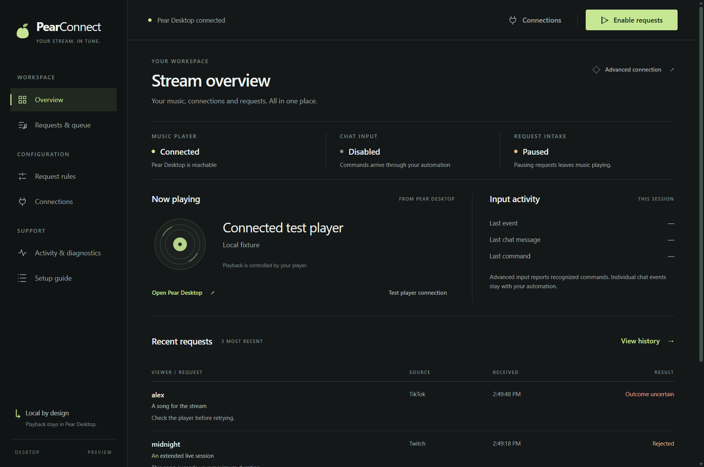

# PearConnect Desktop preview

The desktop console and CLI use one engine with the same rules, permissions and request accounting. This is a preview: automated local tests and packaging pass, but real TikFinity/Pear Desktop acceptance and fresh-machine onboarding remain required before a stable release.

## Windows portable build

In a successful GitHub Actions run, download the **PearConnect-Windows-x64-preview** artifact. Extract the complete folder and open `PearConnect.exe`. Keep its runtime files alongside it. No separate Node.js, npm or Git installation is required to run this build. Builds are currently unsigned; code signing and an installer are separate release work.

For a source checkout, use a current Node.js 22 (22.12 or newer) or 24:

```sh
npm ci
npm run desktop
```

To build the portable Windows folder:

```sh
npm run package:win
```

Output: `dist/PearConnect-win32-x64/`. The package contains only application code, runtime dependencies and the reviewed Streamer.bot package. It excludes `.env`, local settings, Git metadata and development dependencies.

## First run

1. Open the setup guide and choose **Simple · TikFinity Connection** (new-user default) or **Advanced · Streamer.bot & Automation**.
2. Open Pear Desktop and enable its API Server plugin. Use **Authorize PearConnect**, then approve in Pear Desktop. The credential is saved without being printed or copied into the renderer.
3. For Simple, run TikFinity Desktop on the same computer and connect it to your livestream. The default address is `ws://127.0.0.1:21213/`. Edit it in Connections if necessary.
4. Configure commands, cooldowns, duration limits, blocklists and request/skip permissions in Rules.
5. Use **Validate sample request** to check identity, query and basic permissions without player calls or quota changes. Use **Test player connection** separately to verify player reachability. Validation does not prove a search result’s duration or live command delivery.
6. Click **Enable requests** in the top bar. Every desktop launch, mode switch or reconnect starts paused.

Pausing new requests does not pause music. The application shows socket connection, last chat time and last recognized command separately. An open socket does not prove TikFinity is receiving your stream’s chat. In Simple, `!np` and `!queue` results appear in the activity feed; TikTok replies are **not configured**.

Request history shows received/checking/searching/enqueuing and a final result. **Enqueue confirmed** does not mean **playing**. A failed write is shown as **Outcome uncertain**; inspect the player before retrying. The player queue is a read-only snapshot. Its displayed tracks are not assigned to viewers. History is bounded to 200 commands and is not persisted between sessions.

## Desktop layout

The console uses original PearConnect artwork, a graphite and pear-green palette, one navigation sidebar and open sections separated by fine rules. Controls have restrained corners; the interface avoids nested cards and floating overlays. The TikFinity reference informed the emphasis on navigation and connection visibility; its assets and visual design were not reused.

**Overview** shows player, chat input and request intake in one status strip. The request control stays available in the top bar on all six pages. Input activity separates the last event, chat message and recognized command. Recent song requests show the latest four results; Requests & queue and Activity show the bounded command history in accessible tables. Queue tracks remain a separate read-only list.

Rules use labeled form sections, Connections makes Simple/Advanced selection visible, and the setup guide follows a numbered sequence. Keyboard navigation includes a skip-to-workspace link, focus indicators and the current navigation item. Layout checks cover the default 1240-pixel window and the 860-pixel minimum width.



Preview image uses synthetic test data, not a live stream or confirmed playback.

## Existing installations and Advanced setup

Use **Connections → Import existing .env configuration** to select your existing file. The source file is preserved. A file without `CONNECTION_MODE` imports as Advanced. The desktop stores an encrypted copy of credentials in its own app-data directory, and starts paused. It does not silently read or change a CLI checkout’s `.env`.

Close the CLI engine before opening the desktop engine. Both use the same instance lock even if their webhook ports differ. Opening a second desktop focuses the existing window. Opening the desktop while a CLI is running shows a repair message and starts no duplicate listeners. Use Connect after closing the other engine. Attaching the GUI to an existing CLI is not implemented.

Advanced Connections includes Copy endpoint, Reveal/copy secret, Rotate webhook secret, Export action package and Test integration. Follow [the Streamer.bot guide](STREAMERBOT.md) for global values and TikFinity mappings. The desktop’s integration test verifies the local endpoint and authentication; trigger the exported **Connection Test** action to check the entire automation route. A secret rotation pauses requests and requires updating Streamer.bot’s persisted secret. Chat replies remain a separate Streamer.bot/TikFinity configuration.

Twitch and YouTube are independently configurable under Connections. Twitch tokens are entered once and saved encrypted; leaving that field blank preserves the current credential. Clear the channel to disable either adapter. YouTube replies remain local.

## Settings and security

The desktop stores `settings.json` in Electron’s per-user app-data folder (normally `%APPDATA%/PearConnect Desktop` on Windows). Player and webhook credentials and Twitch tokens are encrypted using Electron safeStorage. Encryption must be available; the insecure Linux `basic_text` backend is rejected. A missing/unavailable credential store leaves the repair window open and does not fall back to plaintext. Recovery may require reauthorization on another machine or OS account.

Credentials remain in the privileged main process. A deliberate native dialog can reveal/copy the webhook secret; it never enters the web renderer. The renderer uses a local custom protocol, restrictive content policy, sandbox, context isolation and a fixed set of validated IPC operations. Browser origins remain rejected by the HTTP webhook. Diagnostics use an explicit field allowlist rather than attempting to dump and scrub arbitrary objects.

Preview the diagnostic report in Activity before exporting. The exported bytes match that preview. Reports omit credentials, viewer identities, song/request text, URLs, local paths and raw technical logs. Recent request results and bounded technical logs remain visible locally for troubleshooting.

## Release acceptance still required

- Fresh Windows machine: unzip, authorize, connect TikFinity, test and enable without Node/npm/Git.
- Capture sanitized real TikFinity chat fixtures, then validate handles, string IDs, Unicode and duplicate delivery against the installed version.
- Real Pear Desktop authorization, queue reads, duration parsing and enqueue behavior; live Streamer.bot import and TikTok/Twitch/YouTube delivery.
- Streaming workload: idle CPU/memory, repeated disconnect/reconnect, overnight runtime and player shutdown during writes.
- Code signing and distribution/update policy before promoting the preview to the normal stable download.

Persistent request history, reconciled queue ownership, approval/cancel/remove controls and stream overlays remain the third release described in the design. These controls are intentionally unavailable until external queue edits and restarts can be handled reliably.
